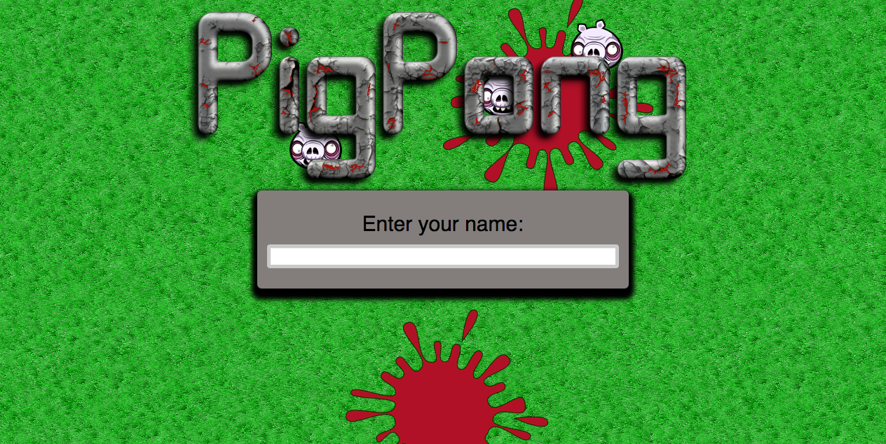
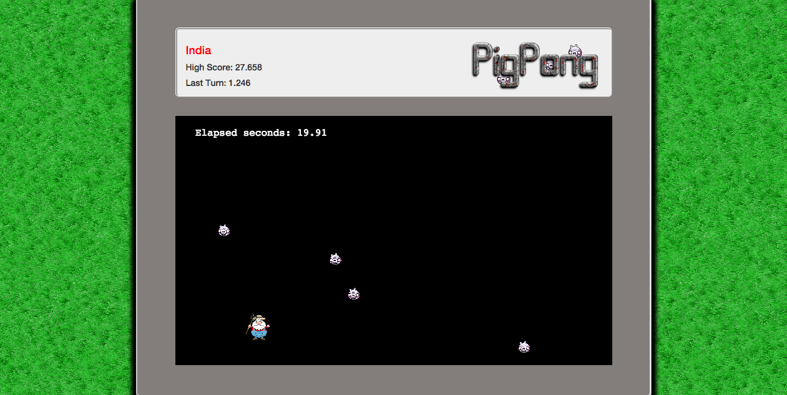

 
 [](https://codeclimate.com/github/ciawalsh/Pig-Pong) [](https://codeclimate.com/github/matteomanzo/PigPong)
=============================================================


## Heroku (live)

 [Pig-Pong]: https://zombie-pig-pong.herokuapp.com/
 
 [Pig-Pong]
 
## Objectives of exercise

* Node
 * Html and CSS
 * JavaScript
 * Testing with node
* Front-end development
* Test-Driven Development
* Phaser game graphics

## Job List

- [x] Create a Homepage with Name Entry
- [x] Create a Game Canvas with a user and an interaction with some sort of object.
- [x] User Friendly Experience
- [ ] Impliment Two Player Mode

## Technologies used

* Javascript
* JQuery
* Node
* Html
* CSS
* Git
* Heroku
* Jasmine
* Websockets

## How to clone this repo

  ```sh
git clone https://github.com/IndiaDearlove/pig-pong.git
 ```
 How to run tests
----
```sh
cd pig-pong
npm test
```

How to run locally
----

```sh
node server.js
```

Visit http://localhost:9999/

## Github profiles of creators

* India - https://github.com/IndiaDearlove
* Hannah - https://github.com/HannahCarney
* Matteo - https://github.com/MatteoManzo
* Charlie - https://github.com/ciawalsh
* Jack - https://github.com/jackrubio26

## About

Made during our 8th week of Makers Academy. Given the task of creating a real time game. The game engine was made using Phaser.

## Screen Shots




 

